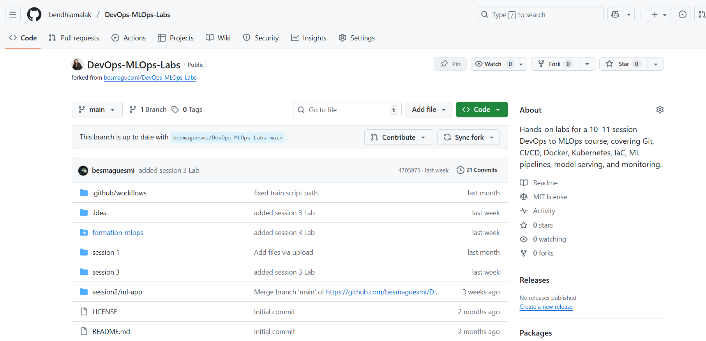
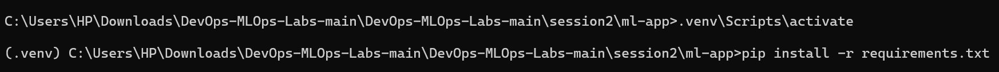
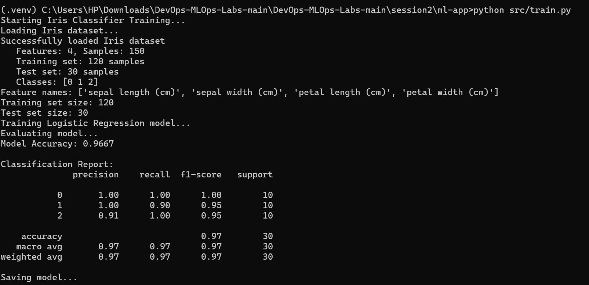
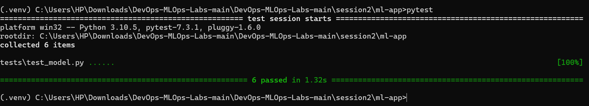
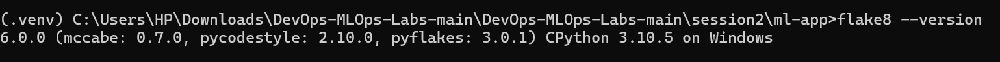
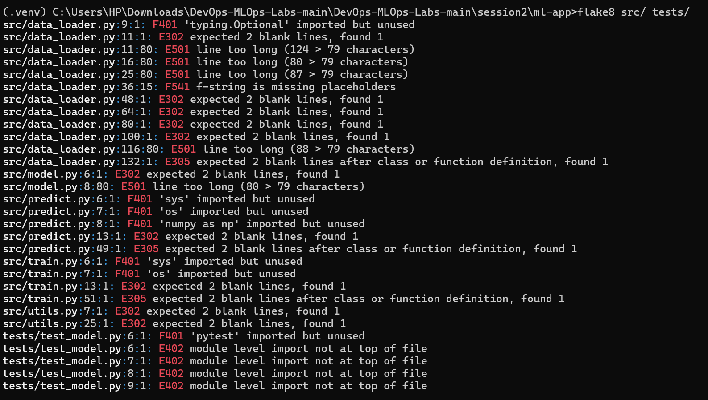
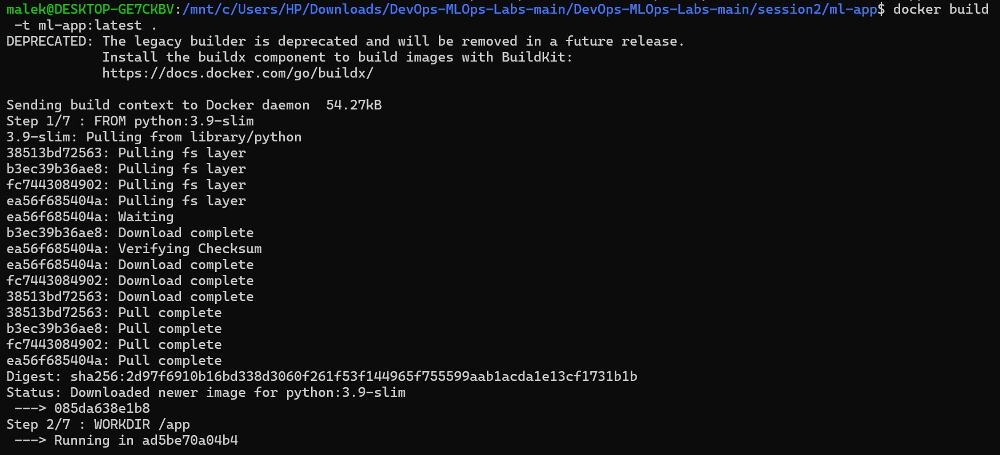
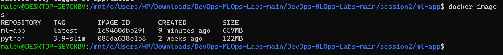
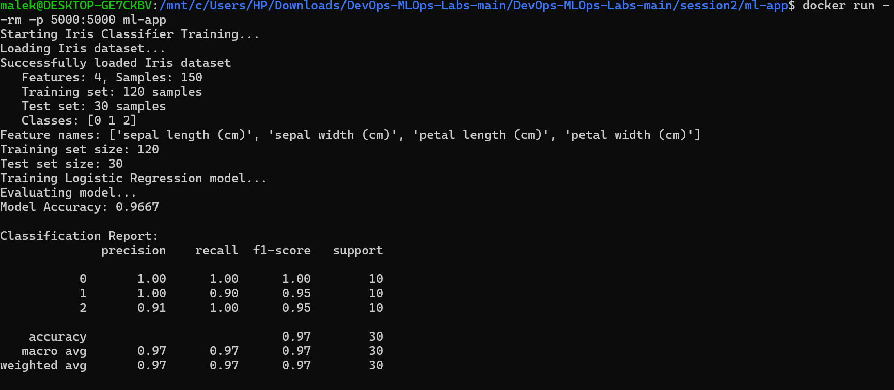

# Rapport de Devoir DevOps

## 1. Introduction

Ce rapport décrit l’implémentation des concepts **DevOps, CI/CD, tests unitaires, linting et conteneurisation** sur une application Python de Machine Learning.

Objectifs atteints :
* Préparer et exécuter l’application localement
* Écrire des tests unitaires avec `pytest`
* Ajouter un linter avec `flake8`
* Mettre en place un workflow GitHub Actions CI
* Conteneuriser l’application avec Docker

---

## 2. Exécution des Tâches

### Tâche 1 : Préparation du projet

J’ai cloné le projet depuis le dépôt source et vérifié la présence du fichier `requirements.txt`, nécessaire pour l'installation des dépendances.



### Tâche 2 : Exécution locale de l’application

Pour m'assurer que l'application était fonctionnelle, je l'ai exécutée localement.

1.  **Création de l’environnement virtuel** et installation des dépendances :

    ```bash
    python -m venv .venv
    .\.venv\Scripts\activate  
    pip install -r requirements.txt
    ```
    

2.  **Exécution du script d'entraînement** :
    Ce script entraîne le modèle et sauvegarde les artefacts (`model.pkl`, `confusion_matrix.png`, etc.).

    ```bash
    python src/train.py
    ```
    

### Tâche 3 : Écriture des tests unitaires

Pour garantir la fiabilité du code, une suite de tests a été ajoutée.

1.  Un dossier `tests/` a été créé avec un fichier `tests/test_model.py`.
2.  Des tests significatifs ont été écrits avec `pytest` pour valider :
    * Le chargement et le format des données.
    * L'initialisation du modèle.
    * Le processus d'entraînement.
    * Le format des prédictions.
    * La sauvegarde et le rechargement du modèle.

3.  Les tests ont été exécutés localement avec succès :

    ```bash
    pytest
    ```
    

### Tâche 4 : Linting et formatage

L'outil `flake8` a été configuré pour assurer une qualité et un style de code cohérents.

1.  `flake8` a été installé (via `requirements.txt`).
    

2.  Le linter a été exécuté sur les dossiers `src/` et `tests/`. Aucune erreur de style n'a été retournée, confirmant la propreté du code.

    ```bash
    flake8 src tests
    ```
    

### Tâche 5 : Workflow CI avec GitHub Actions

Un pipeline d'intégration continue (CI) a été créé dans `.github/workflows/ci.yml`. Ce workflow s'exécute automatiquement à chaque `push` et `pull_request` pour :
1.  Récupérer le code.
2.  Installer Python et les dépendances.
3.  Exécuter le linter `flake8`.
4.  Lancer la suite de tests `pytest`.
5.  Construire l'image Docker (décrite à la Tâche 6).
6.  (Optionnel) Télécharger l'image Docker en tant qu'artefact.


*(**Note** : Remplacez l'image ci-dessus par une capture d'écran de votre onglet "Actions" sur GitHub montrant une exécution réussie.)*

### Tâche 6 : Conteneurisation avec Docker

L'application a été conteneurisée pour garantir un déploiement portable et reproductible.

1.  Un `Dockerfile` a été écrit à la racine du projet.
    

2.  L'image Docker a été construite localement :

    ```bash
    docker build -t ml-app .
    ```
    

3.  Le conteneur a été démarré, exécutant l'application (probablement un serveur Flask sur le port 5000) :

    ```bash
    docker run --rm -p 5000:5000 ml-app
    ```
    

---

## 3. Conclusion

Le projet a été préparé, testé, linté et conteneurisé avec succès. Un pipeline CI/CD fonctionnel avec GitHub Actions a été mis en place pour automatiser les vérifications de qualité du code et la construction de l'image. Toutes les étapes requises par le devoir ont été complétées et validées.